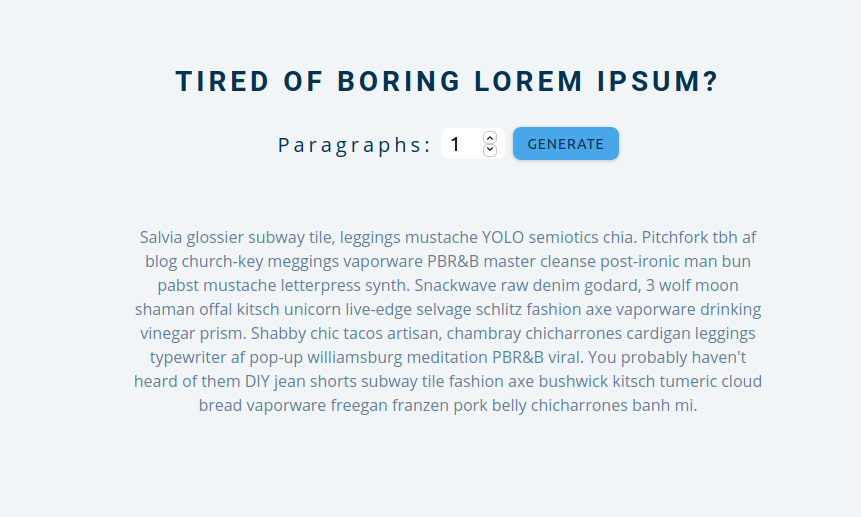

- [color flipper](#color-flipper)
- [counter](#counter)
- [review](#review)
- [Nav](#nav)
- [s-sidebar](#s-sidebar)
- [Modal](#modal)
- [Q&A](#qa)
- [menu](#menu)
- [vedio](#vedio)
- [scroll](#scroll)
- [tabs](#tabs)
- [count Down timer](#count-down-timer)
- [random lorem](#random-lorem)
- [todo](#todo)
- [slider](#slider)

## color flipper

random color picker app there is two option

- simple :chose form 4 colors
- hex: any random hex color

## counter

add,sub reset counter

## review

app to display the description of applicant

- next => to see the next applicant
- prev => to see the provious applicant
- suprise me => chose random applicant

## Nav

not finished yet

## s-sidebar

not finished yet

## Modal

simple modal app

## Q&A

there section when you chose a Q it toggle the Q and hide any other open Q
`section toggler`

## menu

app to filter dishes based in the type you want

## vedio

`background vedio`

## scroll

navbar scroll to the nav item section

## tabs

`tab toggler`

## count Down timer

## random lorem

## todo

## slider

slide img

